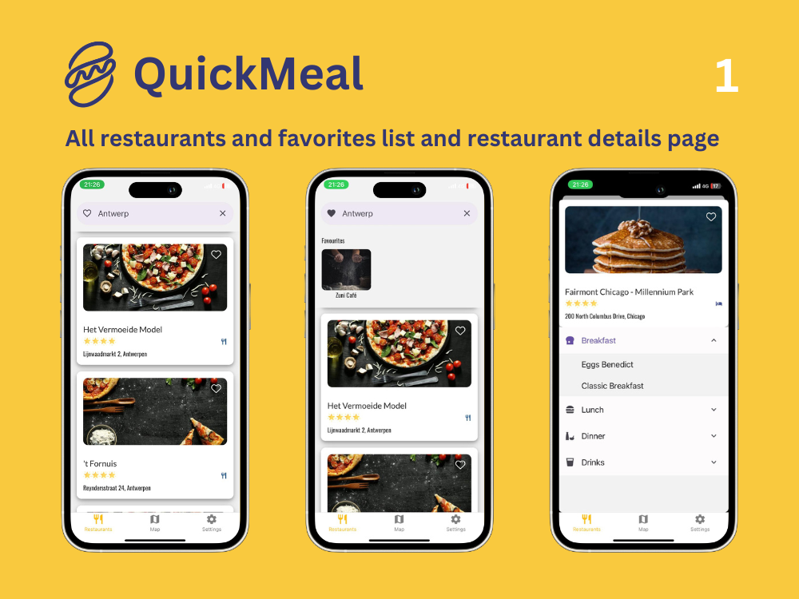

# QuickMeal

Mobile application for iOS and Android to allow authenticated users to look for restaurants on the map and check their details and services, add to favourites and perform payment using Stripe.

## App Features

🟣 Scalable design structure that allows for instant style changes for colors and fonts and spacing on the entire application. Thanks to Styled Components and Themes.

🟣 React Context API

🟣 Expo Async Storage

🟣 Google/Apple Maps using React Native Maps

🟣 Geocoding using Google API

🟣 Navigation between different tabs and sub-tabs

## App Assets:

- Expo Vector Icons
- Expo Google Fonts
- Styled Components for a custom brand styling

## 🛠️ Tech Stack:

React Native, Expo, TypeScript, React Native Paper, Styled Components
