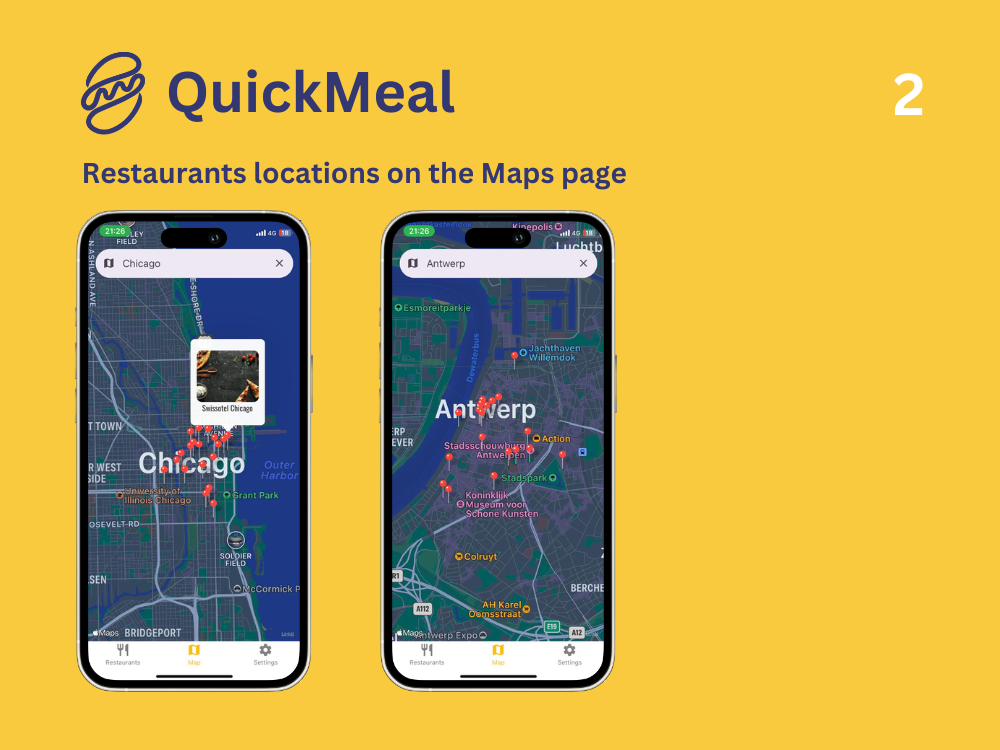

# QuickMeal

Mobile application for iOS and Android to allow authenticated users to look for restaurants on the map and check their details and services, add to favourites and perform payment using Stripe.

# Local setup

1. Clone the app to your system
2. `npm install`
3. `npm run start`

## App Features

🟡 Scalable design structure for the brand identity that allows for instant style changes for colors and fonts and spacing on the entire application. Thanks to Styled Components and Themes.

🟡 React Context API

🟡 Expo Async Storage

🟡 Firebase for user authentication

🟡 Google/Apple Maps using React Native Maps

🟡 Navigation between different tabs and sub-tabs

## App Assets:

- Expo Vector Icons
- Expo Google Fonts
- Styled Components for a custom brand identity styling

## 🛠️ Tech Stack:

Expo, TypeScript, React Native, React Native Paper, Styled Components
